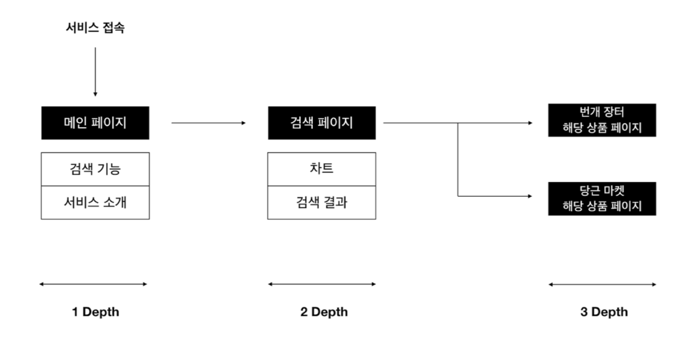
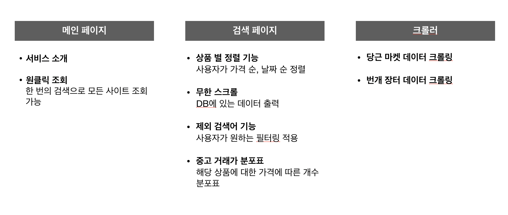
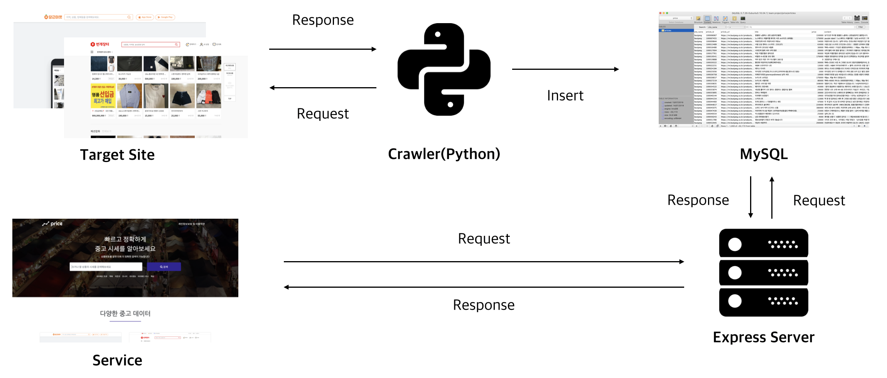
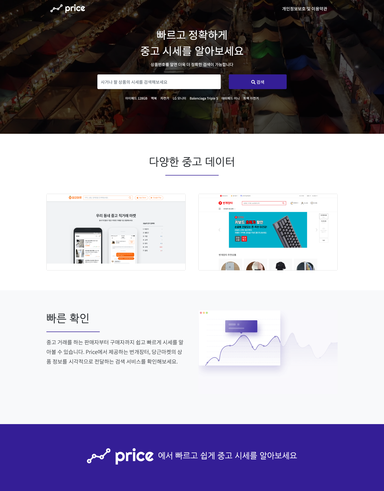

# price

## 1.개요
소비침체가 장기화되면서 중고품 시장 규모는 20 조, 중고나라의 회원수는 1800 만 명에 다다랐으며, 중고나라와 버금가는 서비스인 번개 장터에서는 2018 년 연간 거래액 2,591 억 원을 달성하였다. 이렇듯 중고 시장의 규모가 빠르게 커짐에 따라 주변에서 빈번하게 중고 거래를 하는 것을 볼 수 있다. 하지만 이러한 상황은 저렴하게 구매했다고 좋은 결과만을 낳고 있지는 않다. 판매자들은 가격 경쟁을 하고, 소비자들은 더 좋은 제품을 싼 가격에 거래하기 위해 많은 시간을 들여 여러 플랫폼에서 가격과 상품을 비교하고 있다. 또한, 소비자가 거래한 제품이 합당한 금액에 거래가 되었는지 알지 못하는 점을 이용하여 판매자가 소비자를 속이는 경우도 빈번하게 일어나고 있다.

이러한 배경에서 본 서비스는 'Price 중고 시세 확인'을 통해 소비자들이 많은 시간을 들이지 않고 원하는 가격대에서 좋은 상품을 구할 수 있도록 한다. 그리고 판매자들은 상품에 대한 시세 변동을 확인하면서 합당한 가격으로 소비자에게 판매할 수 있게 함으로써 소비자와 판매자 둘 다 만족하는 거래가 일어나는 기대를 할 수 있다.

## 2.개발스택
   - 2.1 Front-End Framework/Library  
      chart.js, bootstrap, jQuery
   - 2.2 Back-End Framework/Library   
      MySQL, Node.js, Express, body-parser, ejs, ubuntu 16.04
   - 2.3 Crawler  
      Python3, pymysql, requests

## 3.개발내용

### 3.1 최종 개발 목표

3.1.1 Crawler 기능 정의
- 당근 마켓에서 컨텐츠 데이터를 가져와 데이터베이스(MySQL)에 저장한다.
- 번개 장터에서 컨텐츠 데이터를 가져와 데이터베이스(MySQL)에 저장한다.

3.1.2 Back-End 기능 정의
- 사용자가 검색한 상품명에 따라 데이터베이스에서 알맞은 상품 데이터를 클라이언트로 보내준다.

3.1.3 Front-End 기능 정의

메인 페이지

- 서비스에 대한 전반적인 설명을 사용자에게 보여준다.
- 중고 상품을 검색한다.

검색 페이지

- 검색 결과에 대한 중고 시세 분포표를 보여준다.
- 검색 결과에 대한 상품을 리스트업 한다.
- 상품에 대한 카테고리(가격, 날짜) 별 조회가 가능하다
- 사용자가 해당 상품을 클릭하였을 때, 해당 플랫폼으로 이동한다.
- 사용자가 찾고자 하는 상품이 없을 시에는 경고문을 띄어준다.

### 3.2 사이트 맵 및 시스템 구성도

3.2.1 전체 사이트맵

 메인 페이지에서는 검색 기능을 수행하며 부가적으로 서비스에 대한 소개를 하고 검색 페이지에서는 메인 페이지에 대한 결과를 차트와 함께 보여준다. 결과적으로 우리는 해당 상품페이지에 접근할 수 있다.

3.2.2 시스템 구성도

3.3.3 메인페이지

## 4. 기대효과
   - 더욱더 많은 중고사이트를 통합하여 하나의 플랫폼으로 자리잡을 수 있다.
   - 서비스를 통해 중고시장이 다양한 혜택을 제공할 수 없는 한계를 줄여주고 시장 활성화에 큰 도움이 될 것이다.
   - SNS는 젊은 세대에게 다양한 홍보 플랫폼을 제공하고 이는 굉장히 효과적이다. 판매자를 SNS에 공유 할 수 있는 기능을 통해 다양한 고객이 상점을 홍보 시키고 젊은 소비층을 유입시키는 데 도움을 줄 수 있다.